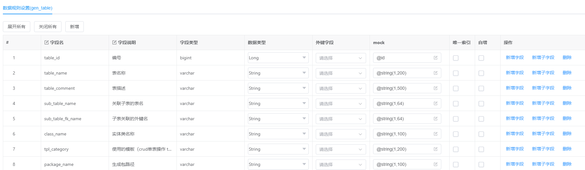
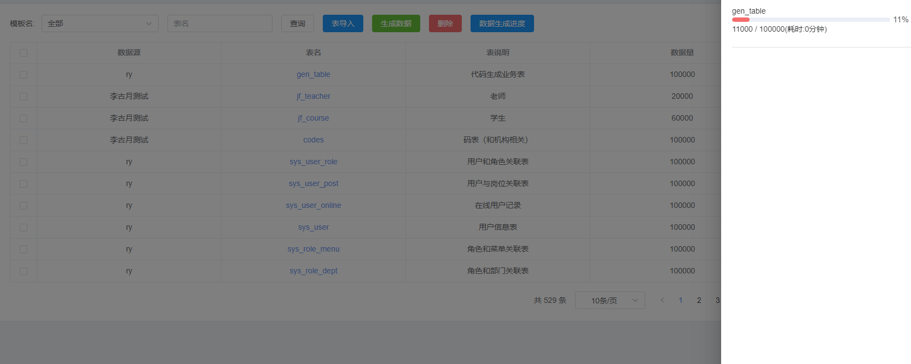
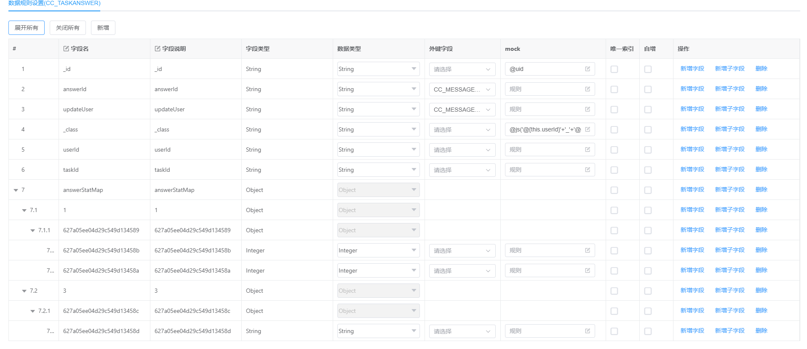
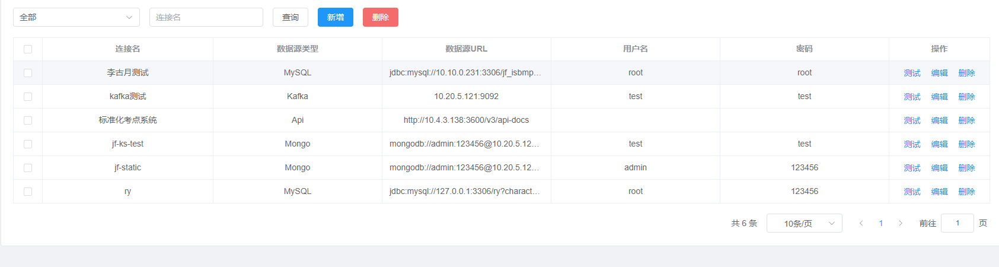
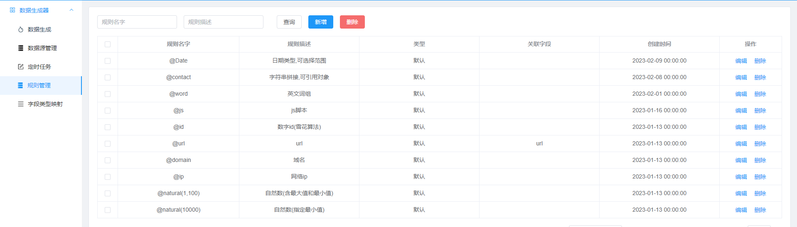
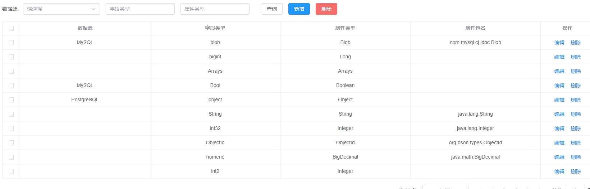

# fast-generator-data

## 项目说明
- fast-data-generator是一款基于mybatisplus+springboot+MYSQL+quartzs 的一款能快速生成测试数据的软件

## 项目特点
- 支持MySQL、Oracle、SQLServer、PostgreSQL、达梦8、MONGO、KAFKA、API等主流数据源
- 支持批量导入表、json导入及同步表结构等功能
- 支持多种mock，如js、正则 、枚举、关联 等mock规则(底层采用mockjs),并且支持自定义mock规则
- 支持测试数据关联外键
- 支持快速生成大数量符合规范标准的测试数据
- 支持编写定时规则定时生成测数据
- 支持测试数据导出为excel,DBF

## 项目特点

-高级mock规则介绍

## 部署方式
- 通过git下载源码
- 如使用MySQL8.0（其他数据库类似），则创建数据库maku_generator，数据库编码为utf8mb4
- 执行db/mysql.sql文件，初始化数据
- 修改application.yml，更新MySQL账号和密码、数据库名称
- 运行GeneratorApplication.java，则可启动项目
- 项目访问路径：http://124.222.236.186

## 效果图

- 脚手架来自gitee开源项目maku
